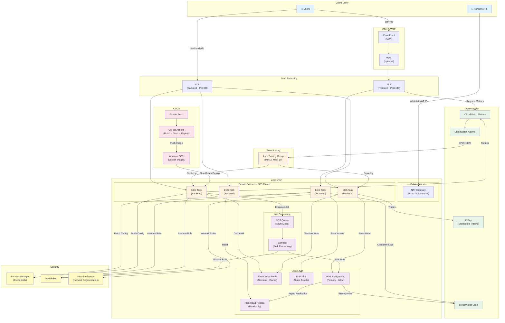
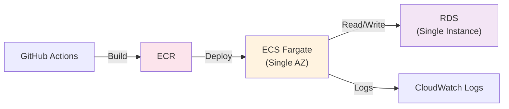
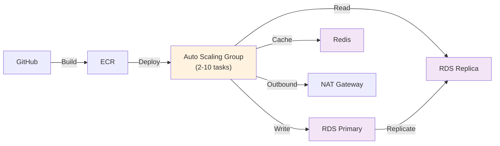
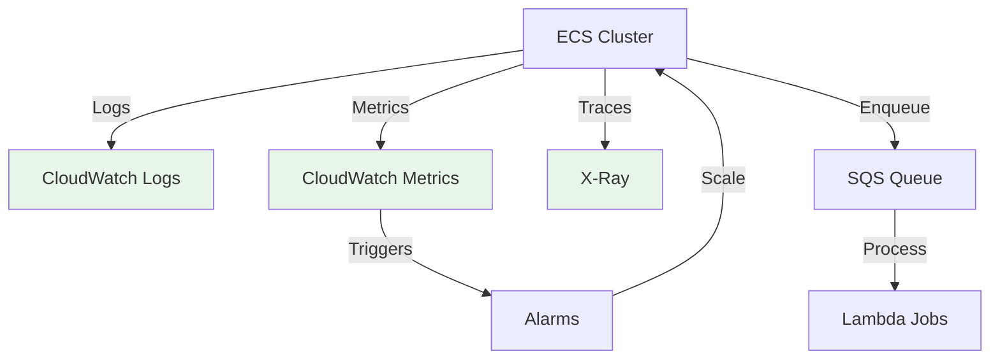
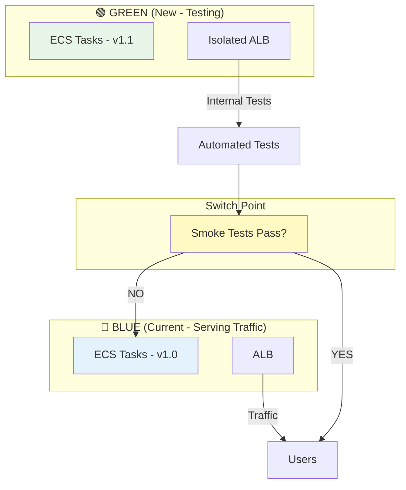
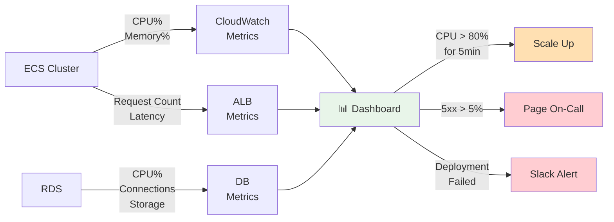

# System Architecture Diagram

Save this as `ARCHITECTURE_DIAGRAM.md` and view in VS Code (or paste into draw.io/Mermaid viewer)

## Proposed Architecture (Mermaid Diagram)



## Phase-by-Phase Deployment

### Phase 1: Foundation (Month 1-3)


### Phase 2: Scalability (Month 4-6)


### Phase 3: Observability (Month 7-12)


## Deployment Strategy: Blue-Green



## Load Spike Handling Comparison

### BEFORE: Single EC2
```
Load Increases
    ↓
Memory Usage ↑↑↑
    ↓
Swap Thrashing
    ↓
Response Time: 10s → 100s
    ↓
Users abandon site 😞
    ↓
Downtime
```

### AFTER: Auto-Scaling ECS
```
Load Increases
    ↓
CloudWatch detects CPU > 70%
    ↓
ASG spawns 2-3 new ECS tasks (10s)
    ↓
Tasks ready, traffic distributed
    ↓
Response Time: 2s (stable)
    ↓
Graceful handling 😊
    ↓
Zero downtime
```

## Database Scalability: Batching Example

### BEFORE: Individual Inserts
```
INSERT INTO events VALUES (1);
INSERT INTO events VALUES (2);
INSERT INTO events VALUES (3);
... (100,000 times)

Time: 100 seconds
RDS Connections: 5
RDS CPU: 90%
I/O Throughput: Saturated
```

### AFTER: Batch Inserts
```
INSERT INTO events VALUES (1), (2), (3), ... (1000);
... (100 times)

Time: 0.5 seconds
RDS Connections: 1
RDS CPU: 10%
I/O Throughput: Normal
```

## Network Topology

```
┌──────────────────────────────────────────────────────────────┐
│                        Internet                              │
│                                                              │
│  Users (0.0.0.0/0)     Partner APIs                        │
│         ↓                      ↓                             │
│      CloudFront ◄─────────────┘                            │
│         ↓                                                    │
│        WAF                                                   │
│         ↓                                                    │
│  ┌──────────────────────────────────────────────────────┐  │
│  │            AWS VPC (10.0.0.0/16)                    │  │
│  │                                                      │  │
│  │  ┌─────────────────────────────────────────────┐    │  │
│  │  │  Public Subnet (10.0.1.0/24)               │    │  │
│  │  │  - ALB (Frontend/Backend)                  │    │  │
│  │  │  - NAT Gateway ◄────────────── Partners    │    │  │
│  │  └─────────────────────────────────────────────┘    │  │
│  │                                                      │  │
│  │  ┌─────────────────────────────────────────────┐    │  │
│  │  │  Private Subnet (10.0.11.0/24)             │    │  │
│  │  │  - ECS Tasks (Frontend)                    │    │  │
│  │  │  - ECS Tasks (Backend)                     │    │  │
│  │  │  - ElastiCache Redis                       │    │  │
│  │  │  - Lambda (Async Jobs)                     │    │  │
│  │  └─────────────────────────────────────────────┘    │  │
│  │                                                      │  │
│  │  ┌─────────────────────────────────────────────┐    │  │
│  │  │  Database Subnet (10.0.21.0/24)            │    │  │
│  │  │  - RDS Primary (Write)                     │    │  │
│  │  │  - RDS Replica (Read)                      │    │  │
│  │  │  - Multi-AZ: Primary in AZ-A, Replica AZ-B│    │  │
│  │  └─────────────────────────────────────────────┘    │  │
│  │                                                      │  │
│  └──────────────────────────────────────────────────────┘  │
│                                                              │
└──────────────────────────────────────────────────────────────┘
```

---

## Key Metrics & Monitoring



